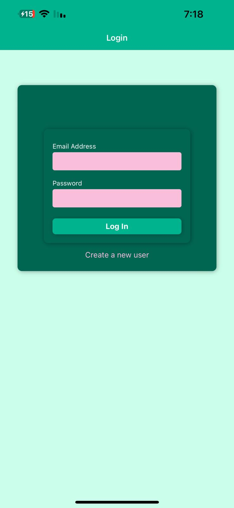
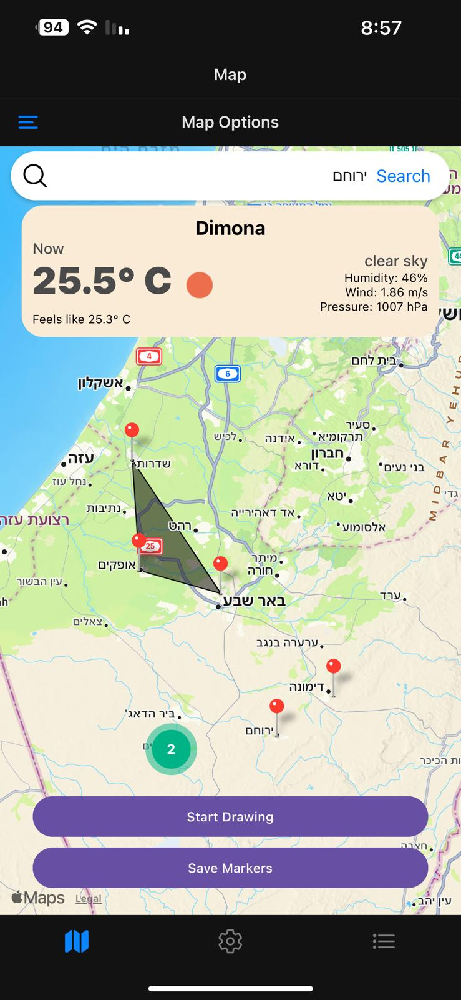
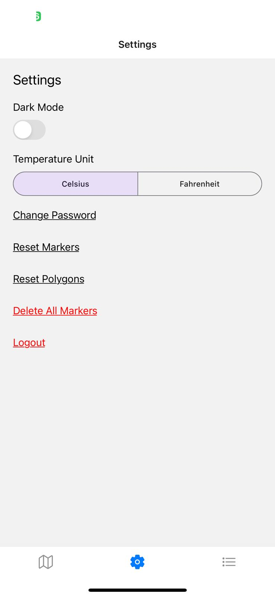
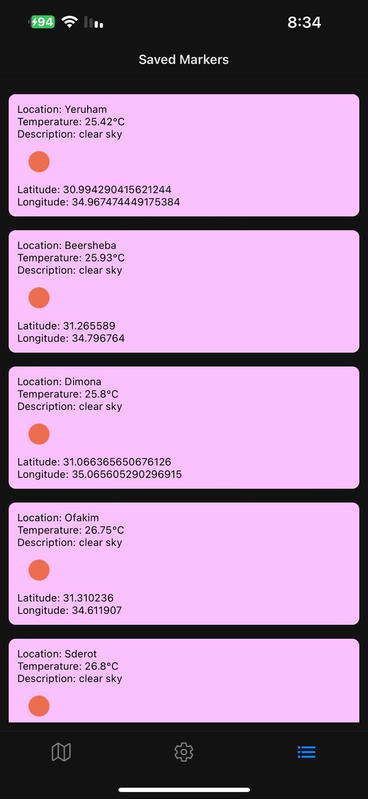
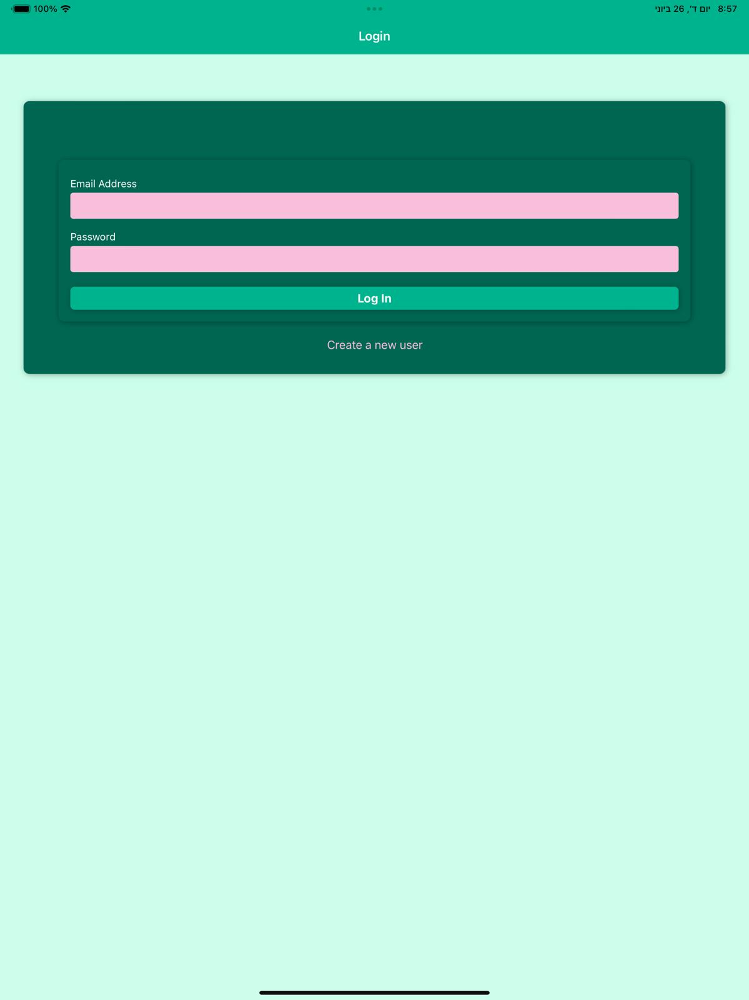
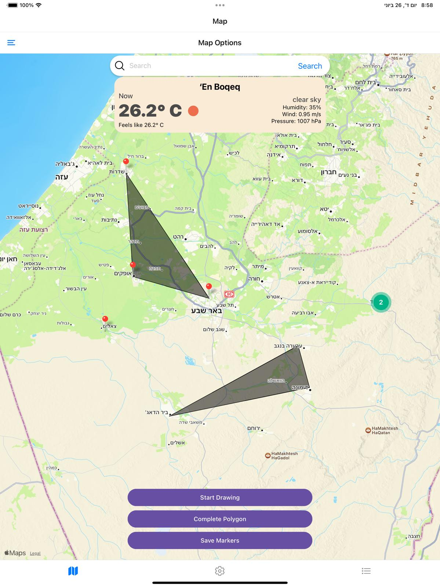
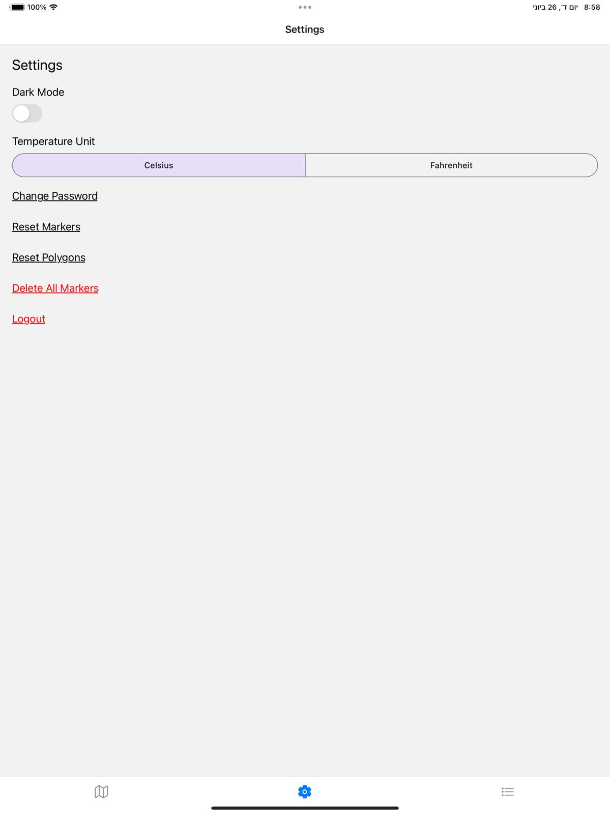
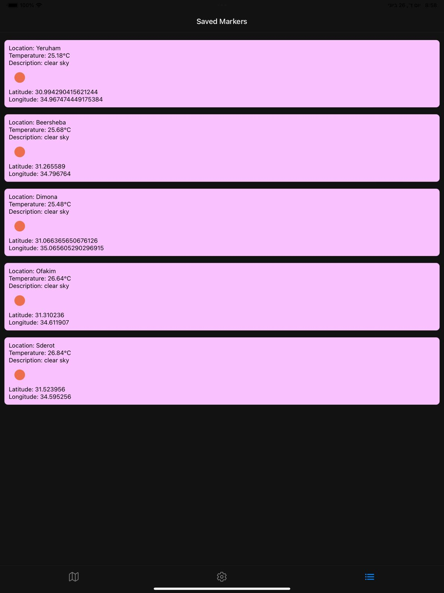

# Interactive Map Application

## Project Description
An interactive map application developed using React Native that allows users to place markers and polygons on a map. The application displays weather data fetched from a weather API. The project supports user authentication and stores marker data in a Firebase Firestore database.
## Features
- **Interactive Map**: Place markers and polygons.
- **Weather Data**: Fetch and display current weather information.
- **User Authentication**: Secure login and registration.
- **Dark Mode**: Toggle between light and dark themes.
- **Temperature Unit Toggle**: Switch between Celsius and Fahrenheit.
- **Firebase Firestore**: Save and delete markers.
- **Responsive Design**: Adjusts to different screen sizes.
- **Marker Clustering**: Group nearby markers.
- **Current Location**: Fetch and display user's current location.
- **Location Search**: Search for places by name.
- **Settings Screen**: Customize app options.

## Installation Instructions

1. **Clone the repository:**
    ```sh
    git clone [repository_link]
    cd <repository-name>
    ```

2. **Navigate to the project directory:**
    ```sh
    cd InteractiveMapApp
    ```

3. **Install dependencies:**
    ```sh
    npm install
    ```
     If the installation fails, try running the following command:
    ```sh
    npm install --legacy-peer-deps
    ```

    **Explanation:**
    The `--legacy-peer-deps` flag is used to address dependency compatibility issues in your project.

4. **Start the application:**
    ```sh
    npm start
    ```

## Usage Instructions

1. Open the application on your device/emulator.
2. Use the search bar to find locations or tap on the map to place markers.
3. Use the buttons to start drawing polygons, complete polygons, reset markers, reset polygons, and save markers.
4. Access the settings screen to toggle dark mode, change temperature unit, change password, delete markers, and logout.

## API Usage Details

- **Weather Data**: Fetched from the OpenWeatherMap API using the following endpoint:
  ```plaintext
  https://api.openweathermap.org/data/2.5/weather
  ```
  - **Parameters**: `lat`, `lon`, `appid`, `units`
- **LocationSearch**: Fetched from the Nominatim OpenStreetMap API using the following endpoint:
    ```plaintext
    https://nominatim.openstreetmap.org/search?format=json&q=${searchQuery}
  ```
  - **Parameters**: `format`, `q`
- **Firebase Firestore**: Used to store and retrieve markers.

## Screenshots

### iPhone Screenshots
<p float="left">
  
   
  
  
</p>

### iPad Screenshots
<p float="left">
  
   
  
  
</p>

## Additional Notes

The project includes several advanced features and components beyond the basic requirements:

- **User Authentication**: Implemented user authentication allowing users to sign up, log in, and log out securely.
- **Dark Mode**: Added support for dark mode, allowing users to toggle between light and dark themes.
- **Temperature Unit Toggle**: Users can switch between Celsius and Fahrenheit units for temperature display.
- **Marker Data Storage**: Implemented marker data storage using Firebase Firestore, enabling users to save and retrieve their markers.
- **Map Marker Clustering**: Added clustering of map markers to improve map performance and readability when many markers are present.
- **Current Location Fetching**: Users can fetch and display their current location on the map.
- **Settings Screen**: The settings screen includes various options:
  - **Change Password**: Users can update their password.
  - **Delete Markers and Polygons**: Options to delete all markers and polygons.
  - **Delete All Markers**: Options to delete all markers From firebase.
  - **Log Out**: Users can log out from their account.
- **Advanced Search Functionality**: Implemented a search bar allowing users to search for locations by name.
- **Bonus Features**: Completed the bonus task by adding an advanced settings screen and various functionalities such as changing the temperature unit and toggling dark mode.
- **TypeScript**: The entire project is developed using TypeScript for better type checking and code quality.


